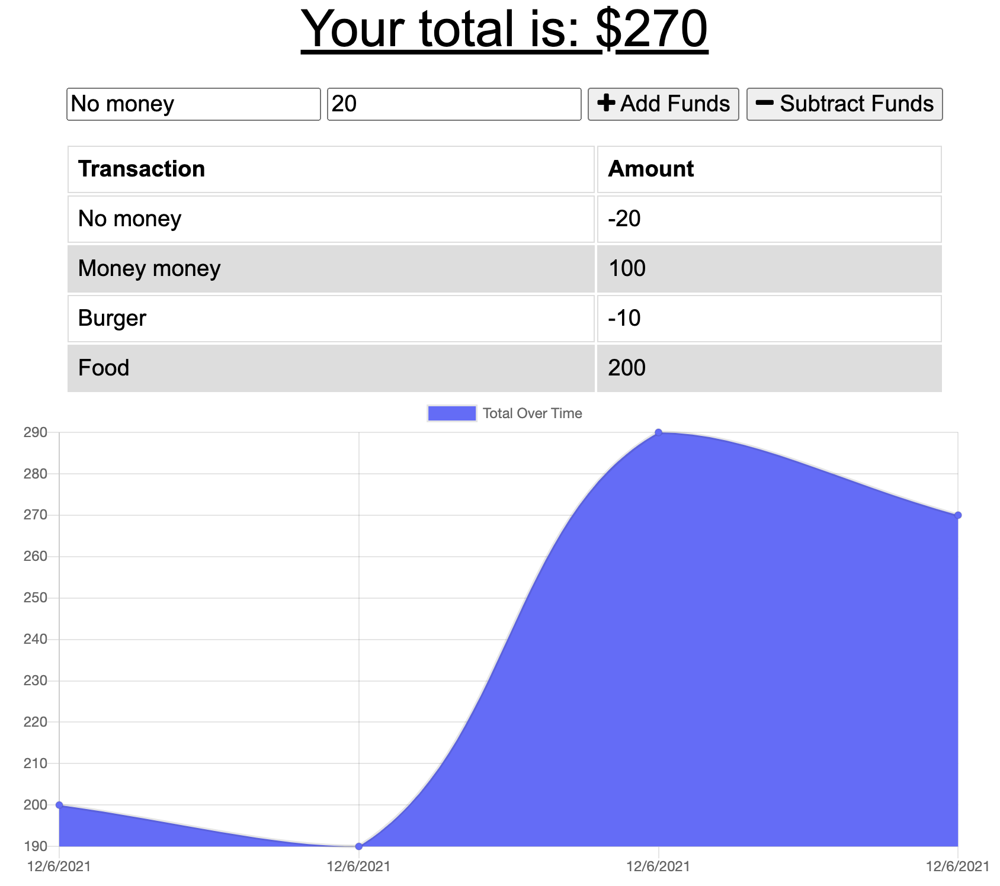

# Progressive Budget Tracker    

  ## Table of contents
  1. [Description](#description)
  2. [Installation](#installation)
  3. [Usage](#usage)
  4. [Contributing](#contributing)
  5. [Tests](#tests)
  6. [Questions](#questions)

  ## Description 

  The user will be able to add expenses and deposits to their budget with or without a connection. When entering transactions offline, they should populate the total when brought back online.

  ## Installation 

  Navigate to the folder of the repo in terminal and the type npm i -> npm start.

  ## Usage 

  This app can be used to track personal finances, incomes and outputs or any convenient functionality for your purposes.

  ## Contributing 

  Anyones can contribute in order to improve the code.

  ## Tests 

  N/A

  ## License

  This project works under a license of type . For more information regarding the license, follow the link 

  ## Questions 

  For additional information or any questions regarding the project, please feel free to contact me via GitHub or email.
  GitHub: MarcoTorr
  Email: marco.torres@aiesec.net

  ## Preview

  

